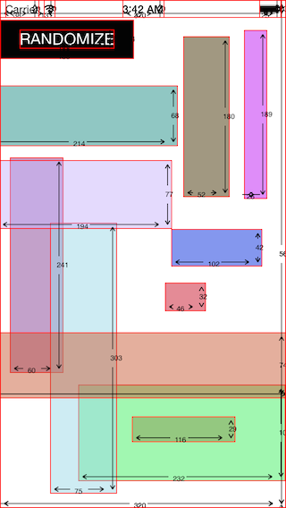
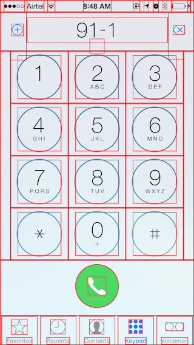
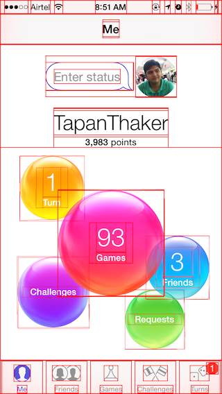

#DebugView

Debug View is a simple implementation of method swizzling to add red borders over each view for Debugging.

##Installation

Download the proj and copy "UIView+Debug.h" & "UIView+Debug.m" in your project
      #import "UIView+Debug.h"
      
      
###If you want to debug a single controller or view

Simply import the "UIView+Debug.h" into that controller or view class

##Examples 

*Note: The examples are generated by randomly creating UIViews*

##Or you could try code injection

